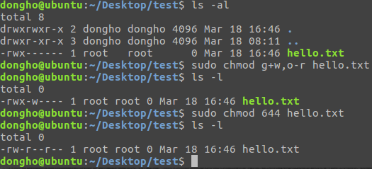

# 1차 과제 - 리눅스 기초

```
학    과 : 컴퓨터 공학과
담당교수 : 황호영
분    반 : 목34
학    번 : 2016722092
성    명 : 정동호
```

---
# 목차
1. Ubuntu Installation
2. Usage of Linux Commands

---
# Ubuntu Installation
## Introduction
리눅스 기초를 다지기 위해 Ubuntu 설치부터 시작한다. 그리고 설치 과정을 캡쳐하고 설명한다.

## Result
기존에 이미 Ubuntu 16.04.03 가상 호스트가 있었지만 과제 수행을 위해 다시 설치하였다.
하드웨어 설정은 다음과 같다:


<figure>

    <figcaption>그림 1-1. 하드웨어 설정</figcaption>
</figure>


다음은 설치 과정 중 언어 팩을 다운로드 하는 장면이다:
<figure>

    <figcaption>그림 1-2. 언어 팩 다운로드</figcaption>
</figure>


다음과 같이 깔끔한 초기 화면을 볼 수 있었다:
<figure>

    <figcaption>그림 1-3. 초기 화면</figcaption>
</figure>


## Reference
https://www.ubuntu.com/download/desktop &mdash; Ubuntu 16.04.4 LTS (Xenial Xerus) 이미지 제공

---
# Usage of Linux Commands
## Introduction
우분투를 설치하고 난 후 리눅스의 기본적인 명령어들은 어떤 것들이 있는 지 알아보고 직접 터미널에서 따라 쳐 보면서 다양한 명령어와 옵션들을 실습한다. 실습에서 사용할 명령어들은 다음과 같다:
- 2주차 : `man`, `cat`, `pwd`, `cd`, `ls`, `chmod`, `mkdir`, `rmdir`, `rm`, `cp`, `mv`, `ln`, `touch`, `exit`, `kill`, `ps`, `pstree`, `time`, `passwd`, `uname`, `wc`, `more`, `echo`, `alias`, `find`, `grep`
- 3주차 : `vi`, `make`, `gdb`

## Result
### 2주차
1. `man`
   <figure>
   <figcaption>그림 2-1-1. man wall</figcaption>
   </figure>

   <figure>
   <figcaption>그림 2-1-2. man -k copy</figcaption>
   </figure>

   <figure>
   <figcaption>그림 2-1-3. man -a write</figcaption>
   </figure>

   먼저 _man \[OPTION...][SECTION] PAGE..._ 에서 옵션 없이 `wall`을 인자로 주었을 때는 `wall`에 대한 설명이 나타나는 것을 볼 수 있었다.
   그리고 -k 옵션을 주고서 `copy`를 인자로 주었을때는 `copy`가 포함된 모든 페이지들의 리스트가 반환되었다.
   마지막으로 `man`에는 여러 섹션이 있고, 동일한 이름의 페이지가 존재할 수 있는데 _\[SECTION]_을 명시하지 않고 a 옵션을 준다면 그림 2-1-3과 같이 한 페이지의 조회가 끝나면 다른 페이지도 조회할 것인지 선택할 수 있다는 것을 볼 수 있었다.

   `man`의 섹션은 일반적으로 다음과 같이 8가지로 나뉜다:
   | 섹션 |                        설명                         |
   | :--: | :-------------------------------------------------: |
   |  1   |                   일반적인 명령어                   |
   |  2   |                      시스템 콜                      |
   |  3   |   라이브러리 함수&mdash;특히 C 표준 라이브러리의    |
   |  4   | 특수 파일(보통 /dev에서 볼 수 있는 장치)과 드라이버 |
   |  5   |                  파일포맷 및 규약                   |
   |  6   |                 게임 및 화면보호기                  |
   |  7   |                     잡다한 것들                     |
   |  8   |             시스템 관리 명령어 및 대몬              |
   모든 `man` page들은 일관성과 간결함을 위해 공통된 양식을 따르고 있다. 이 양식을 통해 페이지들은 가능한한 하이라이팅이나 폰트제어 없이 ASCII만으로 출력하는데 최적화 되고 있다. 양식은 다음과 같다:

   - **NAME** :  명령어 또는 함수의 이름, 뒤이어 무엇을 하는지 한줄 짜리 설명이 나온다.
   - **SYNOPSIS** : 명령어의 경우 어떻게 실행시키는지에 대한 설명을 출력하고, 프로그램 함수의 경우 함수가 취하는 인자들과 해당 함수를 정의한 헤더 파일들에 대한 목록을 나열한다.
   - **DESCRIPTION** : 명령어 또는 함수의 기능에 대한 설명
   - **EXAMPLES** : 일반적인 용례
   - **SEE ALSO** : 관련된 명령어나 함수

   물론 위의 절뿐만 아니라 OPTIONS, EXIT STATUS, ENVIRONMENT, ... 등도 포함할 수 있다.

2. `cat`
   <figure>
   <figcaption>그림 2-2. cat</figcaption>
   </figure>

   사용법은 _cat \[OPTION] [FILE]..._ 이다. 파일들을 잇고(con**cat**enate) 표준 출력으로 내보낸다. 즉 파일의 내용을 출력하는 명령어이며 리다이렉션 `>`을 사용해 결과를 파일이나 다른 곳으로 내보낼 수 있다.

3. `pwd`
   <figure>
   <figcaption>그림 2-3. pwd</figcaption>
   </figure>

   현재 작업 디렉터리의 이름(경로)을 출력한다. 

4. `cd`
   <figure>
   <figcaption>그림 2-4. cd</figcaption>
   </figure>

   **C**hange the current **d**irectory 즉 현재 작업 디렉터리를 변경한다. 이때 인자로 ~를 주면 아무 인자 없는 `cd`와 같은 동작을 하며 현재 유저의 home 디렉터리로 이동한다. -를 주면 환경변수 $OLDPWD에 저장된 이전 경로로 이동한다.

5. `ls`
   <figure>
   <figcaption>그림 2-5. ls</figcaption>
   </figure>

   디렉터리의 내용들을 나열한다. a 옵션을 주면 숨김 파일도 출력해주고 F 옵션을 주면 파일 종류를 표시해준다. 마지막으로 l옵션을 주면 권한, 소유자, 그룹, 이름 등등의 더 자세한 정보를 표시해준다.

6. `chmod`
   <figure>
   <figcaption>그림 2-6. chmod</figcaption>
   </figure>

   사용 문법은 _chmod [options] mode[,mode] file1 [file2 ...]_ 이다. 권한을 지정해줄때 그림 2-6의 처음과 같이 *Symbolic* 모드를 사용하거나 마지막처럼 *Octal* 모드를 사용할 수 있다.
   파일과 디렉터리에 적용되는 권한의 효과는 다음과 같다:
   - **read**(4)
     - **파일**     : 파일의 내용을 읽을 수 있다.
     - **디렉터리** : 디렉터리의 내용(안에 존재하는 파일 또는 하위 디렉터리)을 나열 할 수 있다.
   - **write**(2)
     - **파일**     : 파일의 내용을 바꿀 수 있다.
     - **디렉터리** : 디렉터리내 임의의 파일을 만들거나 지울 수 있다.
   - **exec**(1)
     - **파일**     : 명령어로써 파일을 실행시킬 수 있다.
     - **디렉터리** : 디렉터리의 내용에 접근할 수 있다. 즉 `cd`로 접근이 가능하다.

7. `mkdir`
   <figure>
   <figcaption>그림 2-7. mkdir</figcaption>
   </figure>

   make directories, 디렉터리를 생성한다. directori**es** 라서 인자를 여러개 주면 한번에 여러 폴더를 만들 수 있다. 또는 p옵션을 주면 한번에 subdirectory까지 생성이 가능하다.

8. `rmdir`
   <figure>

   <figcaption>그림 2-8. rmdir</figcaption>
   </figure>

   remove empty directories, 디렉터리를 삭제한다. 단, **디렉터리가 비어있어야 한다**. 그렇지 않은 경우에는 `rm`에 \[rR] 옵션을 주면 된다. 

9. `rm`
   <figure>
   <figcaption>그림 2-9. rm</figcaption>
   </figure>

   파일 또는 디렉터리들을 삭제한다. [rR] 옵션을 주면 비어있지 않은 디렉터리도 하위 폴더를 DFS로 탐색하며 삭제한다. i 옵션을 줄 경우 지울때마다 확인을 거쳐 좀 더 안전한 작업을 할 수 있다.

10. `mv`
      <figure>
      <figcaption>그림 2-10. mv</figcaption>
      </figure>

   `mv`는 **m**o**v**e에서 따온 이름이며 사용 문법은 *mv [OPTION]... SRC DST* 로 원본이 먼저 나오고 목적지가 마지막에 나온다. 기본적으로 파일을 이동시키지만 이름을 바꾸는 데에도 사용할 수 있다.

11. `ln`
      <figure>
      <figcaption>그림 2-11-1. ln</figcaption>
      </figure>

   <figure>
   <figcaption>그림 2-11-2. ln vs cp</figcaption>
   </figure>

   <figure>
   <figcaption>그림 2-11-3. ln symbolic link</figcaption>
   </figure>

   `ln`은 *ln [OPTION]... TARGET [LINK_NAME]* 로 사용한다. 파일들 간에 **l**i**n**k 를 만들어주는 역할을 하며 그림 2-11-1,2 를 통해 `cp`와의 차이점을 알 수 있다. link에는 symbolic&mdash;또는 soft&mdash; 과 hard 두 종류가 있다. 둘의 차이는 다음 그림과 같다:

   <figure>
   <figcaption>그림 2-11-4. soft vs hard</figcaption>
   </figure>

   이외에 hardlink는 같은 파일 시스템에서만 사용하다는 차이도 있다.

12. `touch`
      <figure>
      <figcaption>그림 2-12. touch</figcaption>
      </figure>
    
      빈 파일을 만들거나 파일의 [ma]time을 현재시간으로 변경한다. 
    
13. `ps`
    <figure>
    <figcaption>그림 2-13. ps</figcaption>
    </figure>
    현재 프로세스들의 상태를 보여준다. 강의자료에서 나온 두가지 예를 실행시켜 보았는데 아무 옵션을 주지 않을 경우 t 옵션을 준것과 동일하며 현재 터미널에서 실행자의 EUID를 가진 프로세스들을 나열한다. [eA] 옵션은 모든 프로세스를 출력하고 f 옵션은 더 자세한 정보를 출력해준다.

    필드별 의미는 다음과 같다:

    | 필드명 |             의미              |
    | :----: | :---------------------------: |
    |  UID   |  프로세스 소유자의 유저네임   |
    |  PID   |          프로세스 ID          |
    |  PPID  |       부모 프로세스 ID        |
    |   C    |  CPU 사용량 및 스케줄링 정보  |
    | STIME  |    프로세스가 시작한 시간     |
    |  TTY   |   프로세스가 관련된 터미널    |
    |  TIME  |        전체 CPU 사용량        |
    |  CMD   | 인자를 포함한 프로세스의 이름 |

14. `pstree`
    <figure>
    <figcaption>그림 2-14. pstree</figcaption>
    </figure>

    프로세스들을 트리형태로 출력한다. 전체 프로세스 구조를 파악하는데는 시각적으로 `ps`보다 좋아보인다.

15. `exit`
    <figure>
    <figcaption>그림 2-15. exit</figcaption>
    </figure>
    
    현재 쉘에서 나온다. 그림 2-15에서 처럼 csh 쉘에서 나와 bash로 돌아온 것을 확인할 수 있다.

16. `kill`
    <figure>
    <figcaption>그림 2-16-1. SIGTERM</figcaption>
    </figure>

    `kill`은 *kill [-s sigspec | -n signum | -sigspec] pid | jobspec ...* 또는 *kill -l [sigspec]* 로 사용한다. sigspec을 명시하지 않을 경우 기본으로 15) SIGTERM이 사용된다. 이 경우 `ps`에선 Terminated로 표시되며 다음과 같이 SIGTERM으로 종료되지 않을 경우 9) SIGKILL을 사용한다:
    <figure>
    <figcaption>그림 2-16-2. SIGKILL</figcaption>
    </figure>

17. `time`
    <figure>
    <figcaption>그림 2-17. time</figcaption>
    </figure>
    
    인자로 주어진 프로그램을 실행하고 시스템 자원 사용량을 요약해서 보여주는 명령어이다. 요약 정보에는 real, user, sys가 있는데 각 의미는 다음과 같다.
    - **real** : 실행 시작부터 종료까지의 시간. I/O 지연 및 스케줄링에 인한 대기등도 포함.
    - **user** : 유저모드에서 사용한 CPU 시간.
    - **sys**  : 커널에서 사용한 CPU 시간.

    user + sys 값은 멀티스레드의 경우 각각의 시간을 모두 합하므로 real보다 커질 수 있다. 

18. `passwd`
    <figure>
    <figcaption>그림 2-18. passwd</figcaption>
    </figure>

    유저의 비밀번호를 변경한다. 일반유저는 자신의 비밀번호만 수정할 수 있고 superuser의 경우 모든 계정의 비밀번호를 변경할 수 있다.

19. `uname`
    <figure>
    <figcaption>그림 2-19. uname</figcaption>
    </figure>

    시스템 정보를 출력한다. 아무 옵션도 주지 않을 경우 s 옵션을 준것과 동일하며 기본적인 옵션들의 의미는 다음과 같다.
    - **s** : 커널 이름 출력
    - **r** : 커널 릴리즈 출력
    - **m** : 장비 하드웨어 이름 출력
    - **a** : 모든 정보 출력&mdash;커널 이름, 네트워크 노드 호스트이름, 커널 릴리즈,  커널 버전, 장비 하드웨어 이름, 프로세서 타입, 하드웨어 플랫폼, os 순으로.

20. `wc`
    <figure>
    <figcaption>그림 2-20. wc</figcaption>
    </figure>

    각 파일의 개행, 단어, 바이트 수를 알려준다. 단어 수만 알고 싶다면 w옵션을 주면 된다. 옵션과 파일은 동시에 여러개를 줄 수 있다.

21. `more`
    <figure>
    <figcaption>그림 2-21. more</figcaption>
    </figure>

    출력 결과가 터미널 크기를 넘어가는 경우 사용자 편의를 위해 자동으로 멈춰준다. 눈에 띄는 옵션으로는 **f**(너무 길어서 개행된 줄은 무시), **s**(연속된 빈줄은 하나로 압축), **-number**(사용할 스크린 크기), **+number**(출력을 시작할 줄번호), **+/string**(출력하기 전에 탐색할 문자열)가 있다.

22. `echo`
    <figure>
    <figcaption>그림 2-22. echo</figcaption>
    </figure>
    
    한 줄 짜리 텍스트를 출력한다. 단, e옵션을 줄 경우 backslash escape를 통해 여러 줄도 가능하다.

23. `alias`
    <figure>
    <figcaption>그림 2-23. alias</figcaption>
    </figure>

    `alias`의 인자로 이름=값 쌍을 제공함으로써 비영구적인 별칭(alias)을 만들 수 있다. 나중에도 계속 쓰고 싶으면 ~/.bash_aliases에 등록한다.

24. `find`
    <figure>
    <figcaption>그림 2-24. find</figcaption>
    </figure>
    
    `find`는 *find  [-H]  [-L]  [-P]  [-D  debugopts]  [-Olevel]  [starting-point...]  [expression]* 로 사용하며 디렉터리 계층에서 파일들을 탐색한다. 그림 2-24에서 나온 name옵션은 파일을 탐색할 때 따라오는 경로는 제외할때 쓴다. 
    
    `man find`를 해보니 생각보다 내용이 많아서 다는 못해도 어느정도 정리할 필요를 느꼇다. --delete 옵션을 주면 찾은 파일들을 지운다. -exec em -i {} \; 옵션을 주면 똑같이 지우긴 하나 매번 물어보므로 더 안전하다. -type d 옵션을 줄 경우 디렉터리를 탐색한다. [+-]mtime [+-]num 옵션을 통해 마지막 수정시간으로 탐색이 가능하다. -perm 옵셥을 통해 특정 권한을 가진 파일들을 탐색할 수 있다.

25. 


## Reference
https://en.wikipedia.org/wiki/Man_page &mdash; man page 부가 설명

https://www.interserver.net/tips/kb/learn-linux-file-system-permissions/, 강의자료실-2018-1_SSLab_week02_Unix Linux Commands.pdf &mdash; 전반적인 내용, File permission 부가 설명

`man mkdir` &mdash; 어떻게 mkdir로 subdirectory까지 생성 가능한지 정보

https://askubuntu.com/a/801191 &mdash; soft link vs hard link 부가 설명

`man ps` &mdash; 아무 옵션도 안준 ps는 무엇을 출력하는지 설명

https://kb.iu.edu/d/afnv &mdash; ps의 각 필드의 의미

https://stackoverflow.com/a/556411/7899226 &mdash; time의 각 요약 정보의 의미

`man uname` &mdash; uname 옵션들의 의미

`man more` &mdash; more 옵션들의 의미

https://shapeshed.com/unix-find/ &mdash; find 부가 설명

<style>
figure {
  display: block;
  margin-left: auto;
  margin-right: auto;
  width: 70%;
}

figure img {
    vertical-align: top;
}
figure figcaption {
    text-align: center;
}

</style>